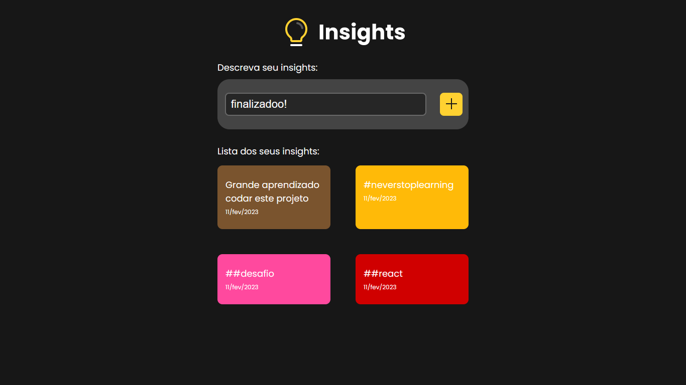

# Insights

Projeto insights, guarde sua ideia em post's!

## Home



## 🚀 Começando


### 📋 Pré-requisitos


```
Ter o Node.js instalado em sua máquina.
```

### 🔧 Instalação

```
Obter o link do repositório do git
```

```
Em seu terminal de comando, executar  *https://github.com/eu-pedro/Insights.git*
```

```
Rodar um *npm install* e depois *npm run dev*
```


## 🛠️ Construído com

* [React](https://pt-br.reactjs.org/docs/getting-started.html) - Biblioteca JavaScript
* [Styled Components](https://styled-components.com/docs) - Biblioteca de estilização

## ✒️ Autores

* **Desenvolvedor FullStack** - [Pedro Henrique](https://github.com/eupedrohenrique)
